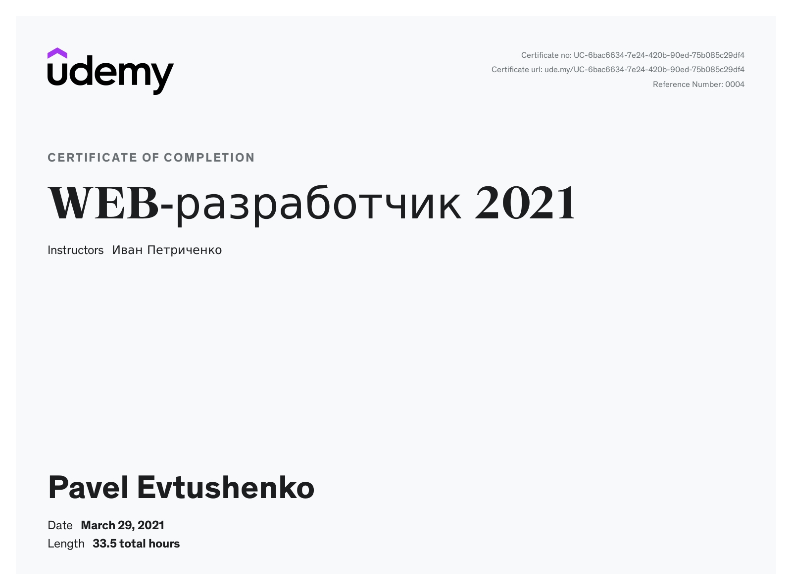

# Pavel Evtushenko

##### Junior Front-end Developer

---

### Contact to me:

- Phone: [+380952453087](tel:+380952453087)
- Email: [whatisclamp@gmail.com](mailto:whatisclamp@gmail.com)
- Telegram: [@stclamp](https://t.me/stclamp)
- Discord: [optimism#3049](https://discordapp.com/users/310482656984956928)

---

### About me

I am currently studying at RSSchool on Front-end developer. Successfully completed RSSchool Stage 0 Front-end. Also completed the Udemy Web-Developer 2021 course.

---

### Skills

- HTML
- CSS
- JS
- Git

---

### Experience

---

### Code Example

**This is solution Kata from Codewars:** In this kata you have to implement a base converter, which converts positive integers between arbitrary bases / alphabets. Here are some pre-defined alphabets:

```
function convert(input, source, target) {
  let result = [];
  let dec = 0;
  let idx = [];
  function convertToDec() {
    idx = input.split("").map((item) => {
      return source.split("").findIndex((f) => {
        return f === item;
      });
    });
    for (let i = 0; i < input.length; i++) {
      dec += idx[i] * Math.pow(source.length, input.length - i - 1);
    }
  }
  convertToDec();
  let preResult = dec;
  let i = 0;
  if (preResult === 0) {
    result.push(target[0]);
  } else {
    while (preResult > 0 || preResult < 0) {
      i = preResult % target.length;
      preResult = Math.trunc(preResult / target.length);
      result.push(target[i]);
    }
  }
  return result.reverse().join("");
}

```

---

### Courses

- Udemy Web-developer 2021:
  

- RSSchool Course «JavaScript/Front-end. Stage 0»

- RSSchool Course «JavaScript/Front-end. Stage 1» (in progress)

---

### Languages

- English (A1)
- Ukrainian (native)
- Russian (native)
